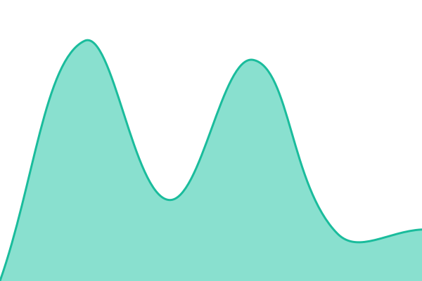

# Estado de mis servicios

Monitorización de tiempo de actividad con [Upptime](https://upptime.js.org):
**sin servidor**. Lo hace todo GitHub — Actions comprueba, Issues registra
las incidencias y Pages publica la página de estado.

## 📈 [Página de estado](https://mdelacruzmelo.github.io/status)

<!--start: status pages-->
<!-- This summary is generated by Upptime (https://github.com/upptime/upptime) -->
<!-- Do not edit this manually, your changes will be overwritten -->
<!-- prettier-ignore -->
| URL | Status | History | Response Time | Uptime |
| --- | ------ | ------- | ------------- | ------ |
|  [Arqland (web pública)](https://arqland.com) | 🟩 Up | [arqland-web-publica.yml](https://github.com/Mdelacruzmelo/status/commits/HEAD/history/arqland-web-publica.yml) | 

 1407ms
     
 | 

<a href="https://Mdelacruzmelo.github.io/status/history/arqland-web-publica">100.00%</a>
    

|  [Arqland (panel de admin)](https://admin.arqland.com) | 🟩 Up | [arqland-panel-de-admin.yml](https://github.com/Mdelacruzmelo/status/commits/HEAD/history/arqland-panel-de-admin.yml) | 

 321ms
     
 | 

<a href="https://Mdelacruzmelo.github.io/status/history/arqland-panel-de-admin">100.00%</a>
    

|  [Arqland API](https://api.arqland.com/api/health) | 🟩 Up | [arqland-api.yml](https://github.com/Mdelacruzmelo/status/commits/HEAD/history/arqland-api.yml) | 

 1256ms
     
 | 

<a href="https://Mdelacruzmelo.github.io/status/history/arqland-api">100.00%</a>
    

<!--end: status pages-->

## Por qué existe

Dos veces en un mismo día, un servicio de Arqland estuvo caído con todos los
despliegues en verde: una porque Cloud Run rechazaba a todo el mundo con un
403 antes de llegar a la aplicación, y otra porque un artefacto de build
reutilizado dejó al lambda sin módulos. En ambos casos nos enteramos porque
alguien abrió la web a mano.

_Desplegado_, _en verde_ y _funcionando_ son tres cosas distintas. Esto
comprueba la tercera.

## Cómo funciona

- Cada **5 minutos** un workflow visita cada URL y comprueba que responde.
- Si falla **dos veces seguidas**, abre una incidencia en este repositorio y
  la cierra sola cuando el servicio vuelve. Dos intentos y no uno porque una
  alarma que salta por un hipo de red es una alarma que aprendes a ignorar.
- El tiempo de respuesta se guarda en `history/` como datos versionados: el
  histórico es git, no la base de datos de un tercero.

## Qué se vigila

Todo se configura en un único fichero, [`.upptimerc.yml`](./.upptimerc.yml).

La API de Arqland no se da por viva con un `200` a secas: tiene que devolver
`"status":"ok"` en el cuerpo. Un contenedor puede estar arriba y la
aplicación muerta.

## Añadir un servicio

Edita `.upptimerc.yml`, añade el sitio con su `name`, `url` y un `tag` del
proyecto al que pertenece, y haz commit. El resto es automático.

**Este repositorio es público** (hace falta para que GitHub Pages y Actions
sean gratis), así que las URLs que pongas aquí quedan a la vista. Para vigilar
algo que no deba verse, guarda la URL como secreto del repositorio y
referénciala como `$NOMBRE_DEL_SECRETO`.

---

Plantilla de [Upptime](https://github.com/upptime/upptime), de Anand
Chowdhary. MIT.
